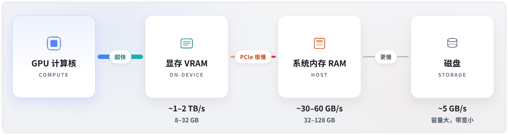

五层地图, 自底向上:

- L0 物理量 —— 容量和带宽, 决定能不能跑、跑多快
- L1 内存拓扑 —— 独立显卡 / Mac 统一内存 / DGX Spark, 我的机器能装多大
- L2 模型 —— 参数量、量化、格式, 怎么把模型压进去
- L3 运行时 —— llama.cpp / vLLM / SGLang / MLX, 谁来跑

# L0: 两个物理量

| 物理量 | 决定什么 | 备注 |
| --- | --- | --- |
| 容量 | 模型能不能跑 | 硬门槛 |
| 带宽 | 每个 token 有多快 | decode 阶段几乎完全由它决定 |

## 两个阶段: prefill 和 decode

一次对话被切成两段, 瓶颈完全不同:

| 阶段 | 干什么 | 瓶颈 | 用户感知 |
| --- | --- | --- | --- |
| prefill | 一次性读完你的 prompt, 算出 KV cache | 算力 (FLOPS) | TTFT, 首字延迟 |
| decode | 一个一个吐 token | 带宽 | tok/s, 吐字速度 |

prefill 是并行的, 几千个 token 一起算; decode 是串行的, 每个 token 都要把权重完整读一遍.

所以下面的公式只管 decode. 长 prompt 卡在第一个字上, 是 prefill 的锅 -> 见 L3 的 SGLang.

## tok/s 带宽计算

生成下一个 token, 必须把这一步用到的全部权重从内存读进计算单元. 读完算一下, 再读下一轮.

```
理论 tok/s = 内存带宽 / ( 激活参数量 * 每参数字节数 )
```

例如: 7B, Q4 (约 0.5 byte/参数) -> 每 token 约读 3.5 GB

| 型号        | 带宽        | 理论 tok/s  |
| --------- | --------- | --------- |
| RTX4090   | 1000 GB/s | 280 tok/s |
| DGX Spark | 273 GB/s  | 78 tok/s  |
| PC ddr5   | 80 GB/s   | 23 tok/s  |

实际上会再打折 (kernel 效率、KV cache、采样), 但数据级对

## KV cache: 容量的第二个吃货

权重是固定开销, KV cache 是变动开销 —— 它随上下文长度线性增长.

每读进一个 token, 都要把它在每一层的 K 和 V 存下来; 后面每生成一个新 token 都要回看这些缓存. 不存就得重算, 复杂度 O(n²).

```
KV cache ≈ 2 × 层数 × KV 头数 × head_dim × 上下文长度 × 每元素字节数
```

拿 Llama3-8B (32 层, 8 个 KV 头, head_dim 128, FP16) 算, 每 token 约 128 KB:

| 上下文 | KV cache |
| --- | --- |
| 4K | 0.5 GB |
| 32K | 4.3 GB |
| 128K | 17 GB |

对比一下: 这个模型 Q4 的权重才 4.9 GB. **32K 上下文的 KV cache 已经和权重一样大, 128K 是权重的三倍多.**

这就是「模型明明装得下, 聊着聊着却 OOM」的原因. 三个办法:
- 调小上下文 (`num_ctx` / `--ctx-size`), 最直接
- 量化 KV cache 到 Q8, 减半
- 换 KV 头数更少的模型 (GQA / MLA, 现在的新模型基本都做了)

# L1: 内存拓扑

## 离散 GPU

最常见的 NVIDIA 台式机, 物理上是两块内存, 中间一座窄桥



| | 特点 | 说明 |
| --- | --- | --- |
| 显存 (VRAM) | 容量小、带宽极大 | 权重必须在这里才快 |
| 内存 (RAM) | 容量大、带宽小一个数量级 | 权重掉到这里 = 灾难性 offload |

## Mac 统一内存

CPU 和 GPU 共享同一块物理 DRAM, 没有 PCIe 拷贝, 也没有显存满了掉到内存这种断崖下降

| 芯片       | 容量上限     | 带宽           |
| -------- | -------- | ------------ |
| M4 Pro   | 最高 64GB  | ~273 GB/s    |
| M4 Max   | 最高 128GB | 410–546 GB/s |
| M3 Ultra | 最高 512GB | **819 GB/s** |

特点:
- 容量: 轻松装 70B Q4 大模型, Ultra 能装更大
- 带宽: 比 5090 ~1792 GB/s 慢, 但比「GPU 装不下、PCIe offload」快一个数量级
- 软件: 没有 CUDA, 主力是 MLX 和 llama.cpp 的 Metal 后端
- 适合部署一张消费卡装不下的模型, 接受 tok/s 不是巅峰

## DGX Spark

NVIDIA 版统一内存小主机, 定位桌面私人超算

- 内存形态: 128GB 统一 LPDDR5
- 带宽: 273 GB/s
- 功耗: ~240W 整机

## 我的显存能跑多大

经验公式:

```
显存需求 ≈ 参数量(B) × 每参数字节数 × 1.2
```

那个 1.2 是 KV cache 和框架开销的余量, 按 4K 上下文估, 上下文拉长要再往上加. Q4_K_M 的每参数字节数实测约 0.55 (L0 为了好算取了 0.5).

常见档位:

| 显存 / 内存 | 舒服跑 | 挤一挤 |
| --- | --- | --- |
| 8 GB | 7B / 8B Q4 | 14B Q4_K_S + 短上下文 |
| 12 GB | 14B Q4 | 14B Q4 + 32K 上下文 |
| 16 GB | 14B Q4 | 32B Q3 (质量掉一档) |
| 24 GB (3090 / 4090) | 32B Q4 | 32B Q4 + 32K 上下文 |
| 48 GB (双卡 / A6000) | 70B Q4 | 70B Q4 + 长上下文 |
| 64 GB 统一内存 | 70B Q4 | 100B 级 MoE |
| 128 GB 统一内存 | 120B 级 | 235B MoE (Q3) |

超出显存不是跑不了, 是掉进 offload —— 权重挤到内存, 带宽从 1000 GB/s 掉到 80 GB/s, tok/s 断崖. 宁可降一档参数量, 也别让它 offload.

总结:
- 小模型要吞吐 -> 独立 GPU (带宽)
- 大模型要能跑 -> 统一内存 (容量)

# L2: 模型

三个物理量:

| 物理量 | 说明 |
| --- | --- |
| 总参数 | 容量 (以及磁盘的体积) |
| 激活参数 | 每个 token 的计算量 + 有效搬运量 -> 速度 |
| 量化 | 每参数字节数 -> 同时缩小容量和带宽 |

## 激活参数

- Dense (稠密)
	- 每个 token 过全部参数. 总参数 = 激活参数
- Sparse (稀疏)
	- 理念: 不是所有参数都对每一个 token 有用, 不同 token 只需要模型一部分"知识". 因此可以只激活子集, 其余参数闲置
	- MoE 是目前大模型里最成功、规模最大的稀疏实现

### MoE 怎么改写公式

拿 Qwen3-235B-A22B 举例, 名字里两个数字正好对应两个物理量:

| 数字 | 是什么 | 决定 | 算出来 |
| --- | --- | --- | --- |
| 235B | 总参数 | 容量 | Q4 约 130 GB, 全部要装进内存 |
| A22B | 激活参数 (Active) | 速度 | 每 token 只搬 22B, 约 12 GB |

于是出现一个反直觉的组合: **容量像 235B, 速度却像 22B**.

- M3 Ultra (819 GB/s, 512GB): 装得下, 理论 819 / 12 ≈ 68 tok/s
- 一张 4090 (1000 GB/s, 24GB): 装不下, 大部分权重掉进内存 offload, 结果比 Mac 慢一个数量级

### 模型名怎么读

`Qwen3-235B-A22B-Instruct-2507-Q4_K_M`

| 段 | 含义 |
| --- | --- |
| `Qwen3` | 家族和代际 |
| `235B` | 总参数 -> 要多少内存 |
| `A22B` | 激活参数 -> 多快. 只有 MoE 才有这段 |
| `Instruct` | 指令微调版, 能聊天. 对应的 `Base` 是基座, 只会续写 |
| `2507` | 版本日期 (2025 年 7 月) |
| `Q4_K_M` | 量化格式 -> 见下一节 |

Dense 模型的名字短一截: `Qwen3-32B-Instruct-Q4_K_M`, 没有 `A` 那段.

## 量化

> 用精度换容量和带宽

量化 = 用更少的比特去存 (有时也去算) 权重 / 激活, 换体积、显存和速度. 常见做法为:
- 整数量化: INT8 / INT4 / GGUF 的 Q4_K_M
- 低精度浮点: FP16 / BF16 / FP8 / NVFP4

| 格式 | 典型场景 |
| --- | --- |
| **GGUF** Q4_K_M / Q5 / Q8 | llama.cpp / Ollama 默认生态, CPU+GPU 都能跑 |
| AWQ / GPTQ / EXL2 | 主要为 GPU 推理 (vLLM、exllamav2) |
| FP8 / NVFP4 | 新卡原生 (Blackwell). Spark 的 1 PFLOP 卖点就在 FP4 |
| MLX 量化 | Mac 专用 |

代价不是零. 大致的质量衰减:

| 量化 | 每参数字节 | 质量 |
| --- | --- | --- |
| FP16 / BF16 | 2 | 原精度, 基准 |
| Q8 | ~1 | 几乎无损, 测不出差别 |
| Q6_K | ~0.8 | 极接近 Q8 |
| Q4_K_M | ~0.55 | 有退化但日常用不出来 -> 甜点 |
| Q3_K_M | ~0.42 | 开始能感觉到, 长逻辑链容易崩 |
| Q2 | ~0.3 | 明显劣化, 不建议 |

一条经验: **同样显存下, 大模型的低量化通常优于小模型的高量化** —— 32B Q3 一般比 14B Q8 强, 但别掉到 Q3 以下.

总结:
- Q4_K_M: 是质量和体积的甜点; Q8: 接近原精度
- 量化让公式里的「每参数字节数」变小, 同样带宽下 tok/s 近似翻倍 (Q8 -> Q4)

## 格式

下载到的模型, 本质是三样东西:
- 一堆张量 (weights): 几十亿个数字, 通常是 float16 / bfloat16
- 一张计算图 (architecture): 矩阵乘、RMSNorm、Attention、RoPE...固定的算子序列
- 附属元数据: tokenizer、chat template、词表、超参

所谓格式, 就是: **这些数字和元数据怎么打包到磁盘上**, 好让某个运行时能又快、又省、又安全地读出来, 并在特定硬件上算

格式不是模型质量本身. 同一个 qwen3.8-27B, 可以是 safetensors、GGUF、ONNX、TensorRT engine, 数学上是同一套权重, 只是包装和数值精度不同

下面六种, 按「你什么时候会撞上」排优先级:

| 格式 | 什么时候遇到 | 优先级 |
| --- | --- | --- |
| GGUF | 用 Ollama / llama.cpp, 本地部署最常见 | ⭐ 主线 |
| safetensors | 从 HuggingFace 下载原始权重 | ⭐ 主线 |
| MLX 权重 | Mac 上跑 | ⭐ Mac 主线 |
| .pt / .pth | 老项目、训练 checkpoint | 背景 |
| ONNX | 浏览器、手机 / Windows NPU | 背景 |
| TensorRT engine | 生产集群 | 背景 |

标「背景」的三种, 知道名字和它解决什么问题就够了.

### .pt/.pth

- PyTorch 原生, 本质 Python pickle 把任意 Python 对象序列化
- 致命问题:
	- pickle 能执行任意代码 (加载恶意模型 = RCE)
	- 绑死 Python, C++/Rust/浏览器 读不了
	- 必须整文件反序列化, 不能 mmap

### Safetensors

- hugging face 为干掉 pickle 设计的, 开源权重的首选发布格式
- 特点:
	- 结构极简
	- 安全: 只有数字, 没有可执行代码
	- 快: mmap() 零拷贝, 可按层懒加载
	- 语言无关: C++/Rust/Python 都能读
	- 不自包含计算图: 只存权重
- 用途: 训练、微调、LoRA、vLLM/SGLang 生产服务的输入

### GGUF

- llama.cpp 团队针对 GGML 的改进版, 单文件开箱即用
- 一个 .gguf 文件就能跑, 里边塞进了
	- 全部权重 (已经量化好)
	- 架构元数据、超参
	- tokenizer、chat template
- 缺点:
	- 从 safetensors 转换而来, 不是训练格式
	- 微调支持很弱 (要微调回去用 safetensors)
	- 不是所有新架构都第一时间被 llama.cpp 支持

### ONNX

- ONNX (Open Neural Network Exchange) 不只存权重, 还把 整张算子图 存进去
- 特点:
	- 框架无关: PyTorch 导出 → ONNX Runtime / OpenVINO / TensorRT / CoreML / WebGPU 都能吃
	- 图优化: 算子融合、常量折叠、在编译期做
	- 覆盖 LLM **之外** 的一切: CV、ASR、embedding、分类器
- 常用于: 浏览器 (transformers.js / WebLLM)、Windows NPU、手机 NPU 等

### TensorRT Engine

- 为某一块 NVIDIA GPU 编译出来的机器码, 生产环境用
- 流程: safetensors → TensorRT-LLM 编译 (针对 H100 / B200、特定 batch、特定最大序列长度) → .engine
- 优点: 同卡上通常比 vLLM 再高 15~30% 吞吐, 适合「模型稳定、卡固定、请求海量」的生产
- 代价:
	- 换卡、改 batch、改最大长度 = 重新编译 (H100 上几十分钟)
	- NVIDIA 绑定

### MLX 权重

- 围绕 Apple 统一内存设计, 权重以量化过的 safetensors 发布
- MLX 通常比 llama.cpp 的 Metal 后端快 15~40%
- 只能跑在 Apple Silicon 上

# L3: 运行时

## 硬件内核

### CUDA (NVIDIA)

- 生态最厚: 几乎所有生产引擎的最快路径就是 CUDA
- 代价: 锁 NVIDIA; 多卡要 NCCL、NVLink

### Metal (Apple)

- Apple Silicon 的 GPU API, 对应 CUDA 在 Mac 上的位置
- 统一内存: CPU/GPU 共享同一块物理内存, 没有 PCIe 拷贝
- 限制: 单机、无多机集群

### Vulkan (跨厂商 GPU)

- llama.cpp 用它做「一块二进制跑很多卡」的便携路径
- 性能通常弱于厂商原生 (CUDA / HIP / Metal), 但可移植性最好
- 适合: 消费级杂牌 GPU、不想为每家写一份 kernel

### NPU (Neural Processing Unit)

- 不是一种 API, 是一类芯片
- 为 低功耗、固定图、量化模型 设计 (INT8/INT4)

## 推理引擎

### llama.cpp

- 便携性之王, 入门首选
- 语言: C/C++, 几乎零依赖, 一个二进制就能跑
- 权重格式: GGUF
- 后端: CPU SIMD、CUDA、Metal、Vulkan、甚至一些 NPU 实验路径
- 调度: 偏单机、单用户; 有 server, 但不是为千并发设计
- 代表产品: Ollama、LM Studio 底层大多是它

强项: CPU、笔记本、边缘、任何奇怪硬件  
弱项: 高并发吞吐吃不满数据中心 GPU; 量化格式和 HuggingFace 主线不完全互通

### vLLM

- 生产环境首选
- 硬件: NVIDIA 一等公民, AMD ROCm / 部分 TPU 也在跟
- 模型: 覆盖最广, 换模型几乎不用重编译
- 强项: 文档、生态、稳定性、「它大概能跑」

### SGLang

- 共享前缀和 Agent 场景首选
- 把 KV 放进一棵前缀树 (radix tree), system prompt、同一篇 RAG 文档、多轮对话历史, 第二次遇到直接命中, 不再 prefill
- 强项:
	- 约束解码 / 结构化输出 (JSON schema)
	- 多步 Agent、工具调用
	- Prefill/Decode 分离部署
- 适合: 聊天、RAG、Agent
- 不适合: 每条 prompt 都独一无二的批量生成

### TensorRT-LLM (TRT-LLM)

- 先把模型编译成一份 TensorRT engine
- 强项: 固定模型、长期在线、要压榨最后 10–20% 的吞吐和 TTFT
- 弱项: NVIDIA only, 换模型/改 shape 要重编译, 运维重

### MLX (引擎)

- Apple Silicon 原生, 后端几乎就是 Metal
- 优点:
	- 量化 Q4/Q8 成熟, 和 HuggingFace 权重转换顺
	- MLX 往往快于 llama.cpp Metal, 因为少一层抽象、吃满统一内存
- 缺点: Apple Only, 没有数据中心调度栈

### ORT

- 微软的跨平台运行时, 到处能跑的工业胶水, 不是跑得最快的 serving 引擎
- ONNX Runtime / ONNX Runtime GenAI
- 灵魂是 Execution Provider (EP): 同一份 ONNX 图, 可挂到不同后端
- 强项: Windows Copilot、Office、端侧、NPU
- 弱项:
	- 不是吞吐冠军
	- 动态图、最新架构 (MLA、新 MoE) 往往慢半拍
	- 转换/量化链路比 GGUF 烦

|               | 最佳场景             | 硬件                             | 核心技术                   | 上手  | 量化                 |
| ------------- | ---------------- | ------------------------------ | ---------------------- | --- | ------------------ |
| **llama.cpp** | 本地、CPU、边缘        | CUDA / Metal / Vulkan / CPU    | GGML + GGUF            | 极易  | GGUF 全家桶           |
| **vLLM**      | 通用生产 serving     | NVIDIA (主)、AMD                  | PagedAttention + 连续批处理 | 中   | FP8、AWQ、GPTQ、GGUF… |
| **SGLang**    | 多轮 / RAG / Agent | NVIDIA 为主                      | RadixAttention         | 中   | 与 vLLM 类似          |
| **TRT-LLM**   | 固定模型极致吞吐         | 仅 NVIDIA                       | 编译期图优化 + Tensor Core   | 难   | FP8、NVFP4、INT8     |
| **MLX**       | Mac 本地 / 研究      | 仅 Metal                        | 统一内存 + 懒计算             | 易   | Q4/Q8              |
| **ORT**       | 端侧、NPU、跨平台产品     | CUDA / CoreML / QNN / OpenVINO | EP 插件                  | 中   | ONNX 量化工具链         |
