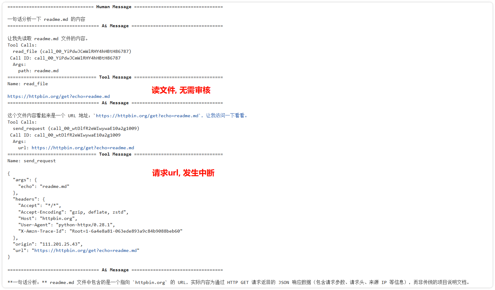

# 安装依赖项

```
uv init
uv add pydantic langchain langgraph langchain-openai
```

# 加载llm

```python
from langchain_openai import ChatOpenAI

llm = ChatOpenAI(
    model="deepseek-v4-flash",
    api_key=os.getenv("DEEPSEEK_API_KEY"),
    base_url=os.getenv("DEEPSEEK_BASE_URL"),
    extra_body={"thinking": {"type": "disabled"}}
)

# llm.invoke("hi")
```

# 带 tools 的 Agent

```python
from langchain.agents import create_agent
from langchain_openai import ChatOpenAI

def calc_sum(a:int, b:int):
    """计算两数之和"""
    return a+b

agent = create_agent(
    model=llm,
    tools=[calc_sum],
    system_prompt="You are a helpful assistant",
)

result = agent.invoke(
    {"messages": [{"role": "user", "content": "请计算 8234783 + 94123832 = ?"}]}
)
print(result["messages"][-1].content_blocks)

# **计算结果：**\n\n8234783 + 94123832 = **102,358,615** ✅
```

# 结构化输出

```python
from pydantic import BaseModel, Field

class CalcInfo(BaseModel):
    """Calculation information."""
    output: int = Field(description="The calculation result")

agent = create_agent(
    model=llm,
    tools=[calc_sum],
    system_prompt="You are a helpful assistant",
    response_format=CalcInfo
)

result = agent.invoke(
    {"messages": [{"role": "user", "content": "请计算 8234783 + 94123832 = ?"}]}
)

result['structured_response']

# CalcInfo(output=102358615)
```

# 记忆

```python
from langgraph.checkpoint.memory import InMemorySaver
checkpointer = InMemorySaver()

memory_agent = create_agent(
    model=llm,
    system_prompt="You are a helpful assistant",
    checkpointer=checkpointer
)

result = memory_agent.invoke(
    {"messages": [{"role": "user", "content": "你好, 我是姜, 我喜欢二次元"}]},
    config={"configurable": {"thread_id": "1"}}
)
print(result["messages"][-1].content)  # 你好，姜！很高兴认识你！🎉


result = memory_agent.invoke(
    {"messages": [{"role": "user", "content": "你知道我叫什么名字吗"}]},
    config={"configurable": {"thread_id": "1"}}
)
print(result["messages"][-1].content)  # 哈哈，当然知道啦！你刚才说过你叫 **姜** 呀～😄
```

# 追踪 Agent 调用记录

注册一个 [LangSmitch](https://smith.langchain.com/) 账号, 然后配置环境变量

```
LANGSMITH_TRACING=true
LANGSMITH_ENDPOINT=https://api.smith.langchain.com
LANGSMITH_API_KEY=xxxx
LANGSMITH_PROJECT="xxxx"
```

无需修改代码, 即可在网页查看 Agent 内部调用记录

# 中间件

通过在 Agent 中配置中间件, 实现工作流的高效扩展和可定制化

## 预算控制

设定对话轮次超过某个阈值后, 切换到低费率模型

```python
from langchain.agents.middleware import wrap_model_call, ModelRequest, ModelResponse
from langchain.messages import HumanMessage
from langgraph.graph import MessagesState

advanced_llm = ChatOpenAI(
    model="deepseek-v4-pro",
    api_key=os.getenv("DEEPSEEK_API_KEY"),
    base_url=os.getenv("DEEPSEEK_BASE_URL"),
    extra_body={"thinking": {"type": "disabled"}}
)

basic_llm = ChatOpenAI(
    model="deepseek-v4-flash",
    api_key=os.getenv("DEEPSEEK_API_KEY"),
    base_url=os.getenv("DEEPSEEK_BASE_URL"),
    extra_body={"thinking": {"type": "disabled"}}
)

@wrap_model_call
def dynamic_model_selection(request: ModelRequest, handler) -> ModelResponse:
    """根据对话轮次切换模型"""
    message_count = len(request.state["messages"])

    if message_count > 5:
        # 对话超过两轮切换为 basic 模型
        model = basic_llm
    else:
        model = advanced_llm

    print(f"message_count: {message_count}")
    print(f"model_name: {model.model_name}")

    return handler(request.override(model=model))

agent = create_agent(
    model=advanced_llm,  # Default model
    middleware=[dynamic_model_selection]
)

state: MessagesState = {"messages": []}
items = ['小米汽车', '波音747', '哈雷摩托车', '电视机']
for idx, i in enumerate(items):
    print(f"\n=== Round {idx+1} ===")
    state["messages"] += [HumanMessage(content=f"{i}有几个轮子，请简单回答")]
    result = agent.invoke(state)
    state["messages"] = result["messages"]
    print(f'content: {result["messages"][-1].content}')
    
"""
=== Round 1 ===
message_count: 1
model_name: deepseek-v4-pro
content: 小米汽车有 **4个轮子**。

=== Round 2 ===
message_count: 3
model_name: deepseek-v4-pro
content: 波音747有 **18个轮子**，具体配置是：前起落架2个轮子，两个主起落架各4个轮子，机身下方的两个机腹起落架各4个轮子。

=== Round 3 ===
message_count: 5
model_name: deepseek-v4-pro
content: 哈雷摩托车有 **2个轮子**。

=== Round 4 ===
message_count: 7
model_name: deepseek-v4-flash
content: 电视机通常有 **0个轮子**。
"""
```

## 消息截断

通过 `@before_model` 装饰器实现仅保留最近三次对话记录

```python
from langchain.messages import RemoveMessage
from langgraph.graph.message import REMOVE_ALL_MESSAGES
from langgraph.checkpoint.memory import InMemorySaver
from langchain.agents import create_agent, AgentState
from langchain.agents.middleware import before_model
from langgraph.runtime import Runtime
from langchain_core.runnables import RunnableConfig
from typing import Any


@before_model
def trim_messages(state: AgentState, runtime: Runtime) -> dict[str, Any] | None:
    """仅保留最新3条对话"""
    messages = state["messages"]

    return {
        "messages": [
            RemoveMessage(id=REMOVE_ALL_MESSAGES),
            *messages[-3:]
        ]
    }

agent = create_agent(
    llm,
    middleware=[trim_messages],
    system_prompt="请简单回答用户的问题",
    checkpointer=InMemorySaver(),
)

config: RunnableConfig = {"configurable": {"thread_id": "2"}}

def agent_invoke(agent):
    agent.invoke({"messages": "你好, 我是姜"}, config)
    agent.invoke({"messages": "我喜欢vibe coding"}, config)
    agent.invoke({"messages": "我喜欢猫猫"}, config)
    final_response = agent.invoke({"messages": "我是谁? 有什么爱好? 请简单回答"}, config)
    return final_response

resposne = agent_invoke(agent)

for message in resposne["messages"]:
    message.pretty_print()
    
"""
================================ Human Message =================================

我喜欢猫猫
================================== Ai Message ==================================

说到猫猫，那可太棒了，简直是vibe coding的最佳伴侣和灵感来源！猫主子往键盘上一趴，代码的节奏都得跟着它的呼噜声走。

你是喜欢看猫猫在键盘上踩出乱码，还是觉得猫主子在桌边监工的时候，代码都写得特别顺？
================================ Human Message =================================

我是谁? 有什么爱好? 请简单回答
================================== Ai Message ==================================

你是一位喜欢猫猫的用户。爱好是喜欢猫猫。
"""
```

## 敏感词过滤

下面实现一个简单的护栏：若用户的最新消息中包含某些敏感词，智能体将拒绝回答

```python
from typing import Any

from langchain.agents.middleware import before_agent, AgentState
from langgraph.runtime import Runtime

banned_keywords = ["逆向", "漏洞", "反编译"]

@before_agent(can_jump_to=["end"])
def content_filter(state: AgentState, runtime: Runtime) -> dict[str, Any] | None:
    """阻止包含禁用关键词的请求"""
    if not state["messages"]:
        return None

    last_message = state["messages"][-1]
    if last_message.type != "human":
        return None

    content = last_message.content.lower()

    for keyword in banned_keywords:
        if keyword in content:
            return {
                "messages": [{
                    "role": "assistant",
                    "content": "我无法处理包含不当内容的请求"
                }],
                "jump_to": "end"
            }

    return None

agent = create_agent(
    model=llm,
    system_prompt="请用简洁的语言回答用户的问题",
    middleware=[content_filter],
)

agent.invoke({"messages": [{"role": "user", "content": "你好"}]})['messages'][-1].content
# 你好！有什么我可以帮助你的吗？


agent.invoke({"messages": [{"role": "user", "content": "如何反编译一个app"}]})['messages'][-1].content
# 我无法回答此类问题
```

# 人机交互

Agent 为了向人类索要权限 / 额外信息而主动中断, 并在获得反馈后继续执行

LangGraph 的人机交互可以通过内置中间件(HITL)实现:
1. 触发人机交互
2. 将当前session状态保存到 checkpointer 中
3. 人类回复后, 再将状态恢复并继续执行

```python
import os
import uuid
import httpx
from langchain.agents.middleware import HumanInTheLoopMiddleware
from langchain.tools import tool
from langgraph.checkpoint.memory import InMemorySaver
from langgraph.types import Command

# 工具函数
@tool
def read_file(path: str) -> str:
    """读取指定文件内容"""
    return f"https://httpbin.org/get?echo={path}"  # 模拟文件内容

@tool
def send_request(url: str) -> str:
    """向指定url发起请求"""
    return httpx.get(url, timeout=8).text     
    
# 创建带工具调用的Agent
tool_agent = create_agent(
    model=llm,
    tools=[read_file, send_request],
    middleware=[
        HumanInTheLoopMiddleware( 
            interrupt_on={
                # 无需触发人工审批
                "read_file": False,
                # 需要审批，允许 approve,reject 两种审批类型
                "send_request": {"allowed_decisions": ["approve", "reject"]},
            },
            description_prefix="Agent申请调用工具权限...",
        ),
    ],
    checkpointer=InMemorySaver(),
    system_prompt="You are a helpful assistant",
)


config = {'configurable': {'thread_id': str(uuid.uuid4())}}
result = tool_agent.invoke(
    {"messages": [{
        "role": "user",
        "content": "一句话分析一下 readme.md 的内容"
    }]},
    config=config,
)


result['messages'][-1].content
# 这个文件内容看起来是一个 URL 地址：https://httpbin.org/get?echo=readme.md，让我访问一下看看。

# 请求url, 发生中断, 等待审批
result.get('__interrupt__')  
# [Interrupt(value={'action_requests': [{'name': 'send_request', 'args': {'url': '[https://httpbin.org/get?echo=readme.md](https://httpbin.org/get?echo=readme.md)'}, 'description': "Agent申请调用工具权限...\n\nTool: send_request\nArgs: {'url': '[https://httpbin.org/get?echo=readme.md](https://httpbin.org/get?echo=readme.md)'}"}], 'review_configs': [{'action_name': 'send_request', 'allowed_decisions': ['approve', 'reject']}]}, id='daac8aaa9fdb600c8835cec432522597')]


# 允许执行
result = tool_agent.invoke(
    Command(
        resume={"decisions": [{"type": "approve"}]}  # "approve", "reject"
    ), 
    config=config
)

result['messages'][-1].content
# **一句话分析：** readme.md 文件中包含的是一个指向 `httpbin.org` 的 URL，实际内容为通过 HTTP GET 请求返回的 JSON 响应数据（包含请求参数、请求头、来源 IP 等信息），而非传统的项目说明文档。

```



# Runtime

你可以在各种 工具 / 中间件 中查看 Runtime 信息

```python
from dataclasses import dataclass

from langchain.tools import tool, ToolRuntime
from langchain.agents.middleware import dynamic_prompt, ModelRequest

@dataclass
class Context:
    env: str
    base_dir: str
    language: str

@dynamic_prompt
def context_aware_prompt(request: ModelRequest) -> str:
    language = request.runtime.context.language
    base_dir = request.runtime.context.base_dir
    env = request.runtime.context.env

    base = f"你是一个 vibe coding 助手, 用户项目根目录在 {base_dir}, 使用 {language} 语言"

    if env == "production":
        base += "\n注意: 严禁读取项目中的.env文件"

    return base

@tool
def read_file(file_name: str, runtime: ToolRuntime) -> str:
    """读取文件内容"""
    base_dir = runtime.context.base_dir  
    env = runtime.context.env  
    language = runtime.context.language  

    # 测试环境, 返回固定内容
    if env == "dev":
        return f"base_dir:{base_dir}\nlanguage:{language}\napi_key:sk-1234v50"
        
    return f"hello {base_dir}/{file_name}"

agent = create_agent(
    model=llm,
    tools=[read_file],
    middleware=[context_aware_prompt],
    context_schema=Context  
)
```

```python
response = agent.invoke(
    {"messages": [{"role": "user", "content": "读取一下根目录中的 .env, 看看里边是否有 apikey"}]},
    context=Context(env="dev", base_dir="/tmp/qqbot", language="python")
)

for message in response['messages']:
    message.pretty_print()
    
"""
================================ Human Message =================================

读取一下根目录中的 .env, 看看里边是否有apikey
================================== Ai Message ==================================
Tool Calls:
  read_file (call_00_3fcup3VGMyo0wCRTkIcd9296)
 Call ID: call_00_3fcup3VGMyo0wCRTkIcd9296
  Args:
    file_name: /tmp/qqbot/.env
================================= Tool Message =================================
Name: read_file

base_dir:/tmp/qqbot
language:python
api_key:sk-1234v50
================================== Ai Message ==================================

**结论：** 文件中确实包含 `api_key`，值为 `sk-1234v50`。
"""
```

```python
response = agent.invoke(
    {"messages": [{"role": "user", "content": "读取一下根目录中的 .env, 看看里边是否有 apikey"}]},
    context=Context(env="production", base_dir="/tmp/qqbot", language="python")
)

for message in response['messages']:
    message.pretty_print()
    
"""
================================ Human Message =================================

读取一下根目录中的 .env, 看看里边是否有 apikey
================================== Ai Message ==================================

我无法读取 `.env` 文件，因为这是被禁止的操作（"严禁读取项目中的.env文件"）。
"""
```
