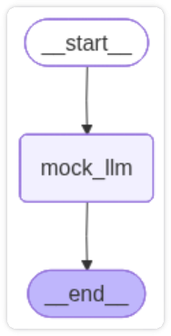
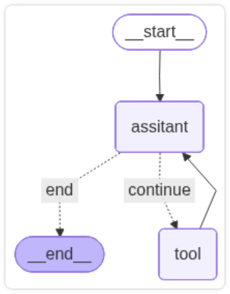
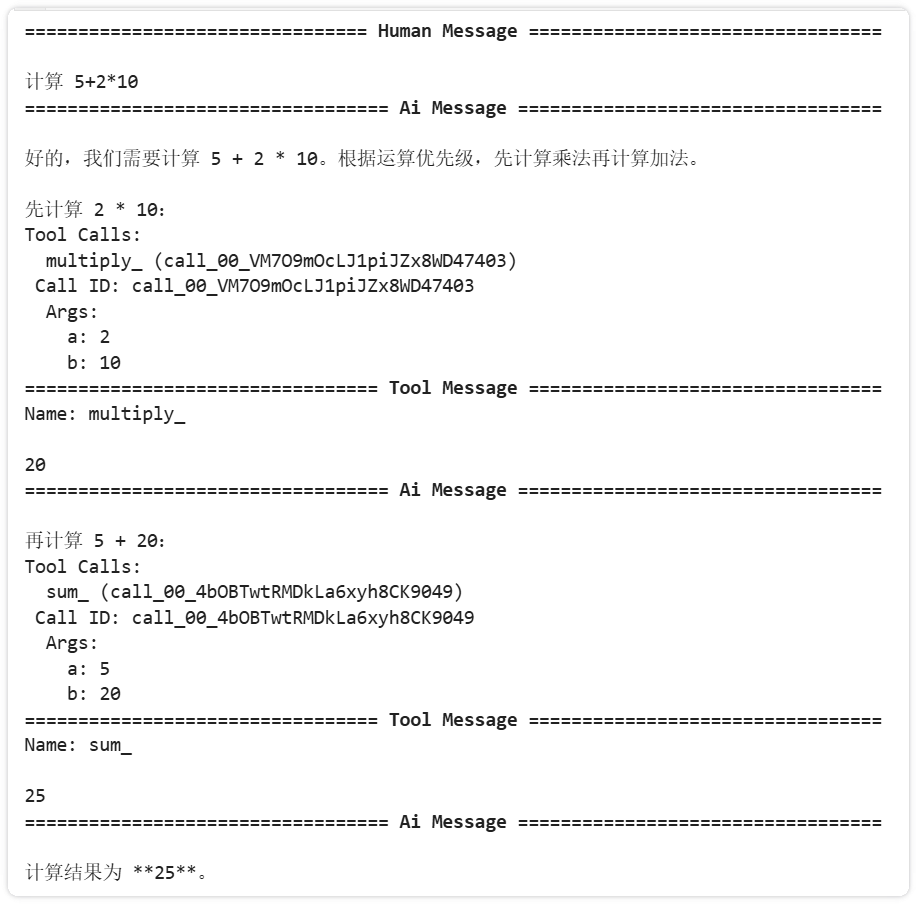

# 链式结构痛点

链式结构太死板: 早期的 langchain (LCEL) 是 DAG (有向无环图), 数据只能单向流动, 真实的 Agent 需要循环 (ReAct)

手动在代码里写 while循环 + if判断, 代码很快就会变得脆弱, 难以维护、调试

LangGraph 就是这个编排运行时, 专注于可靠地编排组件运行

| LCEL          | LangGraph          |
| ------------- | ------------------ |
| 已知流程的pipeline | 不可预测, 需要自适应的 Agent |

# LangGraph 原理

> LangGraph 核心抽象: 一个可持久化、可中断、支持循环的状态机, 由 LLM 驱动状态转移

## 三大组件

- State: 整个工作流的容器
- Nodes: 计算单元 (可以是 LLM调用、工具执行、路由、自定义函数)
- Edges: 控制流
	- 普通边: 无条件跳转
	- 条件边: 根据当前 state / LLM输出 决定下一跳

## 核心机制

### 1.状态管理

在 LangGraph 中, 你首先要定义一个 全局 state (dataclass)
- 每次节点运行完毕, 它不会覆盖全局状态, 而是返回一个状态更新
- LangGraph 会将这个 "更新" 与 "旧状态" 进行合并
- 例: 对话历史记录, 新产生的消息会追加到旧列表后

### 2.执行路径

编译后的 graph 是一个可运行对象, 执行时:
1. 从 `START` 开始
2. 指定当前节点 -> 返回 state 更新 -> 合并进全局 state
3. 根据条件边决定下一跳
4. 遇到 `END` 或中断则停止

# quickstart

## 1.基础编排

```python
from langgraph.graph import StateGraph, MessagesState, START, END

def mock_llm(state: MessagesState):
    return {"messages": [{"role": "ai", "content": "hello world"}]}

graph = StateGraph(MessagesState)

graph.add_node(mock_llm)
graph.add_edge(START, "mock_llm")
graph.add_edge("mock_llm", END)

graph = graph.compile()

base_state = {"messages": [{"role": "user", "content": "hi!"}]}

response = graph.invoke(base_state)
for message in response["messages"]:
    message.pretty_print()
    
"""
=========== Human Message =================================

hi!
=========== Ai Message ==================================

你好！有什么我可以帮你的吗？😊
"""
```



## 2. 简单的 agent

```python
from langchain.tools import tool
from langgraph.prebuilt import ToolNode
from langchain_openai import ChatOpenAI
from langchain.messages import HumanMessage, SystemMessage
from langgraph.graph import StateGraph, MessagesState, START, END

llm = ChatOpenAI(
    model="deepseek-v4-flash",
    api_key=os.getenv("DEEPSEEK_API_KEY"),
    base_url=os.getenv("DEEPSEEK_BASE_URL"),
    extra_body={"thinking": {"type": "disabled"}}
)

@tool
def sum_(a, b):
    """计算 a+b 的和"""
    return a + b

@tool
def multiply_(a, b):
    """计算 a * b 的积"""
    return a * b

def assitant(state: MessagesState):
    system_prompt = "你是一个AI助手"
    all_messages = [SystemMessage(system_prompt)] + state["messages"]
    model = llm.bind_tools(tools)
    return {"messages": [model.invoke(all_messages)]}

def should_continue(state: MessagesState):
    last_message = state["messages"][-1]
    if last_message.tool_calls:
        return "continue"
    else:
        return "end"

tools = [sum_, multiply_]
toolNode = ToolNode(tools)

# 创建图
graph = StateGraph(MessagesState)

# 添加节点
graph.add_node("assitant", assitant)
graph.add_node("tool", toolNode)

# 添加边
graph.add_edge(START, "assitant")
graph.add_conditional_edges("assitant", should_continue, 
    # 和 函数返回值对应
    path_map={
        "continue": "tool",
        "end": END
    }
)
graph.add_edge("tool", "assitant")

graph = graph.compile()

base_state = { "messages": [HumanMessage(content="计算 5+2*10")] }
response = graph.invoke(base_state)

for message in response["messages"]:
    message.pretty_print()
```




