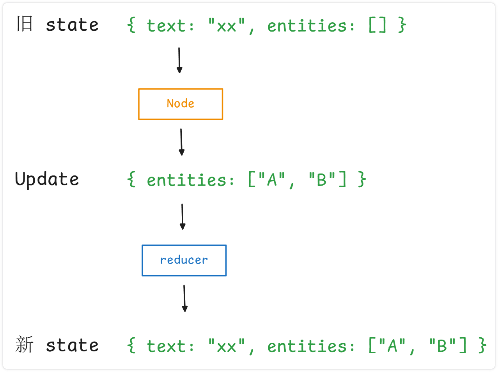

```
State = 数据 / 记忆
Node  = 计算 / 动作
Edge  = 控制流 / 调度
Reducer = 状态更新合并规则
```

# Nodes

假设有一个程序

```python
text = input()

# 提取实体
entities = extract_entities(text)

# 识别产品
products = identify_products(entities)

# 生成结果
result = generate_json(products)

return result
```

本质就是 `数据 -> 计算1 -> 计算2 -> 计算3 -> 结果`, 如果把每一个 "计算步骤" 抽象出来, 这个东西就是 Node.

## state update

从第一性原理上: `Node 就是一个状态转换函数`. 在 StateGraph 中, 官方对 Node 的定义可以写成:

```
state -> Partial<State>
```

注意: Node 通常返回的是 `Partial<State>`, 而不是必须返回完整 State

例:

```python
class State(TypedDict):
	text: str
	entities: list[str]
	
# 一个 Node
def extract_entities(state: State):
	entities = extract(state["text"])
	
	# 注意: 此处并不是返回完整的 state (return state)
    return {
        "entities": entities
    }
```

即:



## 定义 Node

接受如下参数的 python 函数(同步/异步) 即为一个 Node
1. `state`: 图表的状态
2. `config`: 包含配置信息 和 跟踪信息的 RunnableConfig 对象
3. `runtime`: 运行时上下文

在底层, 会将函数转换为 RunnableLambda, 这会为函数添加批处理和异步支持, 以及跟踪和调试

```python

# 示例: 普通 python 逻辑

def normalize_text(state):
    return {
        "text": state["text"].strip()
    }
    
    
# 示例: 调用 LLM
def call_llm(state):
	response = llm.invoke(state["messages"])
	return { "messages": [response] }
	
	
# 示例: 调数据库
def search_database(state):
    result = db.query(state["query"])

    return {
        "documents": result
    }
```

## START、END

START 和 END 是特殊的虚拟节点, 分别代表开始与结束: `START -> A -> B -> END`

```python
add_edge(START, ...)
add_edge(..., END)
```

# Edge

只有 Node 还不够, 例如现在有四个 Node:

```
Node A：理解问题
Node B：搜索资料
Node C：调用工具
Node D：生成回答
```

问题来了: A 执行完以后, 谁执行?

这个下一步去哪的问题, 就是 Edge 负责. 即: **Edge 描述程序的控制流**

## Normal Edge

例如: `A -> B -> C`

```python
builder.add_edge("A", "B")
builder.add_edge("B", "C")
```

A 执行完成一定执行 B, B 执行完成一定执行 C

## Conditional Edge

传入一个路由函数, 根据函数结果来跳到指定的节点

```python
def route(state: State):
    if state["needs_search"]:
        return "search"

    return "answer"


builder.add_conditional_edges( "analyze", route )
```

## 并行执行

一个节点可以有多个出边, 此时所有这些目标节点并行执行

```python
builder.add_edge("A", "B")
builder.add_edge("A", "C")
```

表示:

```
     ┌→ B
A ───┤
     └→ C
```

## Command

> 当需要同时更新状态并路由到不同的节点时, 可以考虑使用 Command

Command 是 用于控制 graph 执行的通用原语. 它接受4个参数:
- `update`: 返回 state 更新 (类似于从 Node 返回更新)
- `goto`: 导航到特定节点 (类似于条件边)
- `graph`: 从子图导航时定位父图
- `resume`: 用于中断后恢复执行


**应用场景**

假设我们有:

```
analyze
   ↓
validate
   │
   ├── passed → save
   │
   └── failed → retry
```

普通的 langgraph 长这样:

```python
def validate(state):
    result = do_validate(state["result"])

    return {
        "validation": result
    }


def route(state):
    if state["validation"]:
        return "save"
    else:
        return "retry"
        
builder.add_conditional_edges( "validate", route )
```

仔细看, 会发现一个问题: validate 中 实际已经知道:
- passed -> save
- failed -> retry

我们又额外执行了一次 route(state), 有些情况下会显得割裂. 此时可以通过 command 实现, 在 Node 中更新状态并路由到指定的节点

```python
# 注意: 此处的 type hint 用以后续图形渲染
def validate(state) -> Command[Literal["save", "retry"]]:
    is_passed = do_validate(state["result"])

	return Command(
		update={"validation": is_passed},
		goto="save" if is_passed else "retry"
	)
```

## Send

默认情况下, Nodes 和 Edges 是提前定义的, 并在相同的 state 上运行. 某些情况下, 可能无法提前知道确切的边 / 或者你需要存在不同版本的 state. **常见于 map-reduce 和 orchestrator-worker 这类动态并行模式**

> 在此类模式中, 第一个节点可能会生成对象列表, 并且你需要将一个 Node 应用于所有这些对象. 对象的数量提前未知 (意味着边的数量未知), 并且下游的 Node 的输入 State 可能不同

例子:  
一个简单的 LangGraph: `START -> split -> process -> END`:
- split 节点执行完毕后, 产生了 n 个对象列表 `[item1, item2, item3, ...]`
- 随后需要对列表中每一个对象调用 process 进行处理  
于是需要 Send

### 本质

```python
from langgraph.types import Send

Send( "process_item", {"item": "A"} )
```

里边有两个核心信息:

```
Send
├── 去哪里？
│      process_item
│
└── 带什么数据过去？
       {"item": "A"}
```

```
                 START
                   │
                   │ 生成任务
                   ▼
                  Send
                   │
        ┌──────────┼──────────┐
        ▼          ▼          ▼
      Worker     Worker     Worker
        │          │          │
        └──────────┼──────────┘
                   ▼
                Reducer
                   │
                   ▼
		          END
```

### 三个能力

1. **动态调用**

	```python
	def dispatch(state):
	    return [
	        Send("worker", {"item": item})
	        for item in state["items"]
	    ]
	```

2. **每个 worker 可以有自己的输入 state**

	假设 主图 state 如下:

	```python
	class State(TypedDict):
	    document: str
	    paragraphs: list[str]
	    results: list[dict]
	```

	你不需要把完整的 state 传递给每个 worker, 可以只发:

	```python
	Send( "extract", {"paragraph": paragraph} )
	```

	于是每个 worker 的输入也可也可以定义成另一个 schema

	```python
	class WorkerState(TypedDict):
	    paragraph: str
	```

	然后:

	```python
	def extract(state: WorkerState):
	    paragraph = state["paragraph"]
	    ...
	```

	官方的 orchestrator-worker 示例就是这么做的：主图有 `State`，worker 单独定义 `WorkerState`，然后每一个 `Send` 只携带对应 worker 所需要的数据


3. **天然形成并行任务**

	```python
	return [
	    Send("worker", {"item": "A"}),
	    Send("worker", {"item": "B"}),
	    Send("worker", {"item": "C"}),
	]
	```

	LangGraph 会把这些任务放到同一个执行阶段中, 并允许并发执行

### 示例

> Send 一般配合 add_conditional_edges 使用, 将 Send 放在路由函数中

```python
class State(TypedDict):
    numbers: list[int]
    results: Annotated[list[int], operator.add]

class WorkState(TypedDict):
    number: int

# Node
def worker(state: WorkState):
    n = state["number"]
    return {"results": [ n * n ]}

# 路由函数
def dispatch(state: State):
    return [
        Send("worker", {"number": n}) for n in state["numbers"]
    ]

graph = StateGraph(State)

graph.add_node(worker)

# 此处第三个参数 path_map 本身无任何作用
# 仅仅为了 graph 流程图可以正确渲染
graph.add_conditional_edges(START, dispatch, ["worker"])
graph.add_edge("worker", END)

graph = graph.compile()

graph.invoke({
    "numbers": [1,3,5,7],
    "results": []
})

# {'numbers': [1, 3, 5, 7], 'results': [1, 9, 25, 49]}
```
