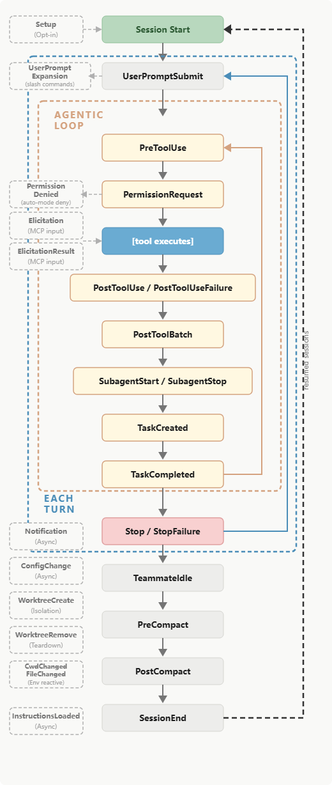

> 从第一性原理看,Claude Code Hooks 本质是:**在 AI agent 的执行生命周期里插入确定性的外部控制点**

Claude Code 不是普通聊天工具,它是可以读/写文件、调用工具的 agent。只靠 prompt 约束它,本质上是概率性的

Hooks 把某些规则从「希望模型记住」变成「系统在关键节点强制执行」

## Claude Code 的基本执行循环

```text
用户输入
  ↓
Claude 理解任务
  ↓
决定是否调用工具
  ↓
工具执行:读文件 / 写文件 / Bash / MCP / 子代理
  ↓
Claude 根据工具结果继续推理
  ↓
任务完成,准备停止
```

Hooks 就是把这个流程切开,在关键位置插入控制点:

```text
用户输入
  ↓
[UserPromptSubmit hook]
  ↓
Claude 准备调用工具
  ↓
[PreToolUse hook]
  ↓
工具真正执行
  ↓
[PostToolUse hook]
  ↓
Claude 准备结束
  ↓
[Stop hook]
```

## Hook 解决的根本问题:把「建议」变成「机制」

普通 prompt 是:

```text
请不要运行 rm -rf
请修改代码后自动格式化
请完成任务前运行测试
```

这类约束的问题是:模型可能忘记、可能理解偏、上下文长了之后指令遵循能力下降

改用 Hooks:

```text
每次 Bash 之前,程序检查命令。
每次 Write/Edit 之后,程序自动格式化。
每次 Stop 之前,程序检查测试是否通过。
```

从「语言约束」变成了「强制执行」

## Hooks 生命周期




整体可分为三层生命周期:

```text
Session 生命周期
  └─ Turn 生命周期
       └─ Agentic Loop 工具调用循环
```

### 最外层:Session

每个会话一次

- **SessionStart**:Claude Code 启动新 session、恢复 session、/clear、compact 后触发
- **SessionEnd**:在 Claude Code session 终止时触发

### 中间层:每个 Turn 的生命周期

用户每提交一次输入,就进入一次 turn。

一次 turn 的主线如下:

```text
UserPromptSubmit
  ↓
Agentic Loop
  ↓
Stop / StopFailure
```

### 核心层:Agentic loop

Claude 在此处反复执行

```text
思考下一步
  ↓
调用工具
  ↓
观察工具结果
  ↓
继续判断是否还要调用工具
```

## Hook 三要素:事件、匹配器、处理器

一个 Hook 可以拆成三个基本部件:

```text
Event = 在哪个生命周期点触发 (何时)
Matcher = 只对哪些情况触发 (对谁)
Handler = 触发后执行什么 (做什么)
```

一个典型的配置:

```json
{
  "hooks": {
    "PreToolUse": [
      {
        "matcher": "Bash",
        "hooks": [
          {
            "type": "command",
            "command": "${CLAUDE_PROJECT_DIR}/.claude/hooks/block-dangerous.sh"
          }
        ]
      }
    ]
  }
}
```

### [event](https://code.claude.com/docs/en/hooks#hook-events)

- `SessionStart` / `SessionEnd`:会话级初始化与清理
- `UserPromptSubmit`:用户提交 prompt 之后,Claude 处理之前
- `PreToolUse`:工具执行之前
- `PostToolUse`:工具执行之后
- `Stop`:Claude 认为已完成本轮,准备停止时
- `Notification`:Claude 发送通知(例:等待用户输入、等待权限确认等)
- ...

### [matcher](https://code.claude.com/docs/en/hooks#matcher-patterns)

| 匹配器值              | 评估为                    | 示例                                                                        |
| ----------------- | ---------------------- | ------------------------------------------------------------------------- |
| `"*"`、`""` 或省略    | 匹配所有                   | 在事件的每次出现时触发                                                               |
| 仅字母、数字、`_` 和 `\|` | 精确字符串或 `\|` 分隔的精确字符串列表 | `Bash` 仅匹配 Bash 工具;`Edit\|Write` 精确匹配任一工具                                 |
| 包含任何其他字符          | JavaScript 正则表达式       | `^Notebook` 匹配任何以 Notebook 开头的工具;`mcp__memory__.*` 匹配来自 `memory` 服务器的每个工具 |

每个 event 可以配置不同的 matcher,进行细分

| 事件                                                                                     | 匹配器过滤的内容       | 示例匹配器值                                                                                                              |
| -------------------------------------------------------------------------------------- | -------------- | ------------------------------------------------------------------------------------------------------------------- |
| `PreToolUse`、`PostToolUse`、`PostToolUseFailure`、`PermissionRequest`、`PermissionDenied` | 工具名称           | `Bash`、`Edit\|Write`、`mcp__.*`                                                                                      |
| `SessionStart`                                                                         | 会话如何启动         | `startup`、`resume`、`clear`、`compact`                                                                                |
| `Setup`                                                                                | 哪个 CLI 标志触发了设置 | `init`、`maintenance`                                                                                                |
| `SessionEnd`                                                                           | 会话为何结束         | `clear`、`resume`、`logout`、`prompt_input_exit`、`bypass_permissions_disabled`、`other`                                 |
| `Notification`                                                                         | 通知类型           | `permission_prompt`、`idle_prompt`、`auth_success`、`elicitation_dialog`、`elicitation_complete`、`elicitation_response` |
| ...                                                                                    |                |                                                                                                                     |

### [handler](https://code.claude.com/docs/en/hooks#hook-handler-fields)

上述示例配置中,handler 使用了 command 类型。

Hooks 共支持如下五类 handler:

| 类型       | 适用场景       | 介绍                                                  |
| -------- | ---------- | --------------------------------------------------- |
| command  | 最稳定        | 运行 shell 命令,脚本在 stdin 接收 json 输入,通过退出码和 stdout 返回结果 |
| http     | 审计系统、CI服务  | 将事件 json 作为 http post 到 url,响应 json                 |
| prompt   | 模糊规则、语义判断  | 向 Claude 模型发送提示进行评估,模型返回 yes/no                     |
| agent    | 需要读代码等复杂验证 | 启用一个 subagent 进行处理                                  |
| mcp_tool | 接入已有 mcp   | 调用 mcp tool,该工具的输出视为 hook stdout                    |

## Hooks 位置

| 位置                                                                                                                  | 范围    | 可共享          |
| ------------------------------------------------------------------------------------------------------------------- | ----- | ------------ |
| `~/.claude/settings.json`                                                                                           | 所有项目  | 否,本地于您的计算机   |
| `.claude/settings.json`                                                                                             | 单个项目  | 是,可以提交到仓库    |
| `.claude/settings.local.json`                                                                                       | 单个项目  | 否,gitignored |
| 组织策略设置                                                                                                              | 组织范围  | 是,管理员控制      |
| [Plugin](https://code.claude.com/docs/en/plugins) `hooks/hooks.json`                                                | 启用插件时 | 是,与插件捆绑      |
| [Skill](https://code.claude.com/docs/en/skills) 或[subagent](https://code.claude.com/docs/en/sub-agents) frontmatter | 组件活跃时 | 是,在组件文件中定义   |

## [Hook 输入 & 输出](https://code.claude.com/docs/en/hooks#hook-input-and-output)

对于 command hook,通过 stdin 接收 JSON 数据,并通过退出码、stdout 和 stderr 传回结果

例如:对于 `PreToolUse` hook,输入为:

```json
{
  "session_id": "e2407fd8-37f6-4b59-8144-5999642826be",
  "transcript_path": "/home/zzzzls/.claude/projects/-mnt-d-package-hookEvent/e2407fd8-37f6-4b59-8144-5999642826be.jsonl",
  "cwd": "/mnt/d/package/hookEvent",
  "permission_mode": "plan",
  "effort": {
    "level": "xhigh"
  },
  "hook_event_name": "PreToolUse",
  "tool_name": "Bash",
  "tool_input": {
    "command": "ls -la /mnt/d/package/hookEvent",
    "description": "List files in the working directory"
  },
  "tool_use_id": "toolu_01LvE9TJQtSRMRnULcve3Dn4"
}
```

可以使用脚本读取它:

```bash
#!/bin/bash

# 从 stdin 读取 JSON 输入,检查命令
command=$(jq -r '.tool_input.command' < /dev/stdin)

if [[ "$command" == rm* ]]; then
  echo "blocked: 不允许执行rm命令" >&2
  exit 2  # 阻止工具调用
fi

exit 0  # 允许调用
```

退出码控制:
- exit 0:允许
- exit 2:阻止

通过 json 输出控制

```bash
#!/bin/bash

command=$(jq -r '.tool_input.command' < /dev/stdin)

if [[ "$command" == rm* ]]; then
  jq -n '{
    hookSpecificOutput: {
      hookEventName: "PreToolUse",
      permissionDecision: "deny",
      permissionDecisionReason: "blocked: 不允许执行rm命令"
    }
  }'
else
  exit 0  # 允许调用
fi
```

## 常用场景

### 安全拦截

> PreToolUse + Bash

拦截危险命令:

```text
rm -rf /
sudo ...
curl ... | bash
生产环境数据库写操作
读取 .env / 私钥
```

### 自动格式化

> PostToolUse + Edit|Write

Claude 改完文件后自动执行

```text
lint
format
```

### 完成前跑测试

> Stop hook

Claude 准备结束时:

```text
npm test / pytest

# 如果失败,echo
{
  "decision": "block",
  "reason": "测试失败,请继续修复"
}
```

### 上下文注入

> SessionStart / UserPromptSubmit / PostToolUse

注入:

```text
当前 git 分支
当前环境是 dev/staging/prod
最近 CI 状态
当前 issue 编号
当前数据库连接只读
```

### 审计日志

> PreToolUse / PostToolUse / SessionEnd

记录:

```text
Claude 执行过什么 Bash
改了哪些文件
哪些命令被拒绝
本轮会话持续多久
是否触碰敏感目录
```

### 通知

> Notification

- 桌面通知
- 等待输入提醒
- 任务完成提醒
