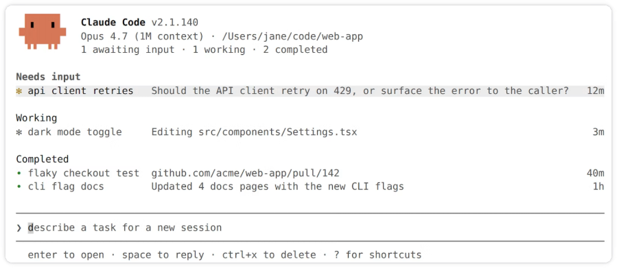
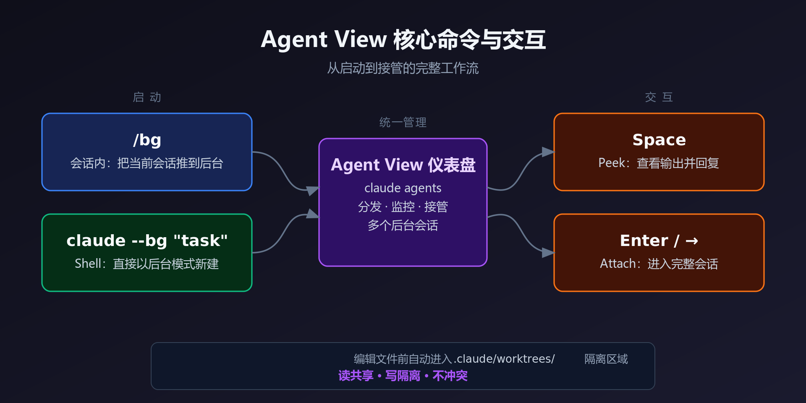

# 痛点

Claude Code 传统交互方式是一个终端窗口绑定一个会话。有如下缺点:

- 一个任务卡住后,终端被占住
- 多个任务需要多个终端窗口
- 很难知道哪个任务在工作、哪个任务在等待输入、哪个任务完成了
- 任务之间容易相互干扰,尤其是同时改同一份代码

# Agent View

> 需要 v2.1.139+ 版本。把 Claude session 变成后台 job。

Agent View 会打开一个统一页面,用来分发、监控和接管多个后台 Claude Code session。

每个后台 session 都是一个完整的 Claude Code 对话,可以在没有终端附加的情况下继续运行,必要时可以重新 attach 进去。

# Quickstart

## 启用新 session

- **从 shell 启用**(*自动以 shell 目录作为根目录*)
	- `claude --bg "更新 readme.md 文档"`
	- `claude --name "docs" --bg "xxxx"`

- **从会话内部**
	- `/background` 或 `/bg`
	- `/bg xxx`:进入后台化前先给出一个额外指令

- **从 Agent View**
	- 在底部输入框输入提示并按 Enter 启动新的后台会话

## 进入 Agent View

- `claude agents`
- `claude agents --cwd <path>`:打开 Agent View,仅展示 path 下启动的会话
- `claude agents --json`:以 JSON 数组方式打印 Agent View

## 观察状态

Agent View 会把所有会话按状态分为三组:

| 状态          | 说明      |
| ----------- | ------- |
| Needs input | 等待输入/授权 |
| Working     | 正在工作    |
| Completed   | 已经完事    |

- 默认情况下,按照状态分组每个会话(跨越所有项目)
- 使用上下键选择不同的会话
- 切换显示视图:`ctrl+s`(按状态分组 / 按项目分组)
- 重命名:`ctrl+r`
	- 也可以在启动时通过 `--name` 指定名字
	- 或进入会话中通过 `/rename` 重命名
- 置顶会话:`ctrl+t`
- 排序会话:`shift + ↑↓`
- 折叠会话:在组标题上按 `Enter`

## 就地回复

选中会话后按 空格 打开 peek 面板,显示当前会话最近的输出。

此时可以 **输入内容** 按回车后将其发送到该会话,不需要进入。

## 附加 / 分离会话

- 附加会话:在选定的行上按 `Enter` 或 `→` 进入该会话完整的交互式会话窗口
- 分离会话:在交互式会话中按 `←` 或 `ctrl+z` 分离会话,该会话仍在后台运行

## 停止 / 删除会话

选中某个会话后:

- 停止会话:`ctrl+x`
- 删除会话:连按两次 `ctrl+x`

> 注意:删除会话时,会自动删除该会话对应的 worktree,包括其中未提交的更改。

# 技术细节

- supervisor 守护进程
	- 每个后台会话都有独立的 supervisor 管理,与终端解绑
	- 关掉窗口,继续跑
	- 关掉终端,继续跑
	- Claude 自动更新,继续跑
	- 电脑休眠:会暂停,重启后 `claude respawn --all` 恢复

- 文件隔离机制
	- 后台 session 同时改代码不会冲突,编辑文件前自动进入 git worktree

- 状态存储位置
	- `~/.claude/daemon.log`:监督进程日志
	- `~/.claude/daemon/roster.json`:运行中的后台会话列表,用于在重新启动后重新连接
	- `~/.claude/jobs/<id>/state.json`:在 Agent View 中显示的每会话状态

# 相关

- [[内置斜杠命令]] —— `/background`、`/bg`、`/rename` 等斜杠命令的完整介绍
