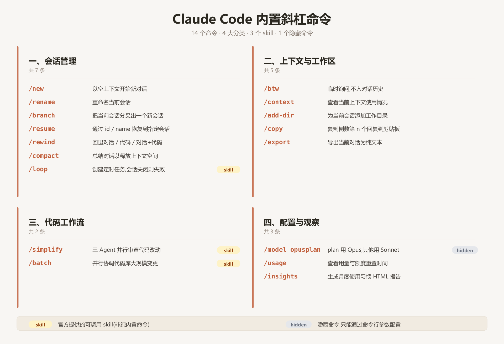

## 命令总览

| 分类          | 命令                                 | 用途                             |
| ----------- | ---------------------------------- | ------------------------------ |
| **会话管理**    | [/new](#new)                       | 以空上下文开始新对话                     |
|             | [/rename](#rename)                 | 重命名当前会话                        |
|             | [/branch](#branch)                 | 把当前会话分叉出一个新会话                  |
|             | [/resume](#resume)                 | 通过 id / name 恢复到指定会话           |
|             | [/rewind](#rewind)                 | 回退对话 / 代码 / 对话+代码              |
|             | [/compact](#compact)               | 总结对话以释放上下文空间                   |
|             | [/loop](#loop) `[skill]`           | 创建定时任务, 会话关闭则失效                |
| **上下文与工作区** | [/btw](#btw)                       | 临时询问, 不入对话历史                   |
|             | [/context](#context)               | 查看当前上下文使用情况                    |
|             | [/add-dir](#add-dir)               | 为当前会话添加工作目录                    |
|             | [/copy](#copy)                     | 复制倒数第 n 个回复到剪贴板                |
|             | [/export](#export)                 | 导出当前对话为纯文本                     |
| **代码工作流**   | [/simplify](#simplify) `[skill]`   | 三 Agent 并行审查代码改动               |
|             | [/batch](#batch) `[skill]`         | 并行协调代码库大规模变更                   |
| **配置与观察**   | [/model opusplan](#model-opusplan) | plan 模式用 Opus, 其他用 Sonnet (隐藏) |
|             | [/usage](#usage)                   | 查看用量与额度重置时间                    |
|             | [/insights](#insights)             | 生成月度使用习惯 HTML 报告               |

## 一、会话管理

### /new

> 参数: 无

以空上下文开始新对话, 可通过 /resume 恢复之前对话

### /rename

> 参数: `[name]`

重命名当前会话

### /branch

> 参数: `[name]`

把当前会话分叉出一个新会话

### /resume

> 参数: `[session]`

通过 id / name 恢复到指定的会话

### /rewind

> 参数: 无

回退 对话 / 代码 / 对话+代码

> 若 claude 本轮实现不满意, 可通过本命令回退

### /compact

> 参数: `[instructions]`

总结到目前为止的对话来释放上下文空间. 可以传递用以总结的 instruction

### /loop

> 参数: `[interval] [prompt]`
> 类型: skill

在当前会话中创建一个定时任务, 会话关闭则自动失效

> 例: /loop 1m 检查一下是否测试是否执行完毕

## 二、上下文与工作区

### /btw

> 参数: `<question>`

临时询问一个问题, 本次对话不会加入对话历史

### /context

> 参数: `[all]`

查看当前上下文的使用情况

### /add-dir

> 参数: `<path>`

为当前会话添加一个工作目录, 用于文件访问

### /copy

> 参数: `[n]`

复制倒数第 n 个回复到剪切板

### /export

> 参数: `[filename]`

将当前对话导出为纯文本. 可选择导出文件 / 剪切板

## 三、代码工作流

### /simplify

> 参数: `[focus]`
> 类型: skill

同时启动三个 Agent, 从代码复用、代码质量、运行效率 三个角度审查你的改动

> 例: /simplify 给我重构意见

### /batch

> 参数: `<instruction>`
> 类型: skill

并行地在代码库中协调大规模变更. 分析代码库, 将工作分解为 5 到 30 个独立单元, 并呈现计划. 一旦批准, 为每个单元在一个隔离的 git worktree 中生成一个后台 agent 开始处理. 需要 git 仓库

> 例: /batch 将 /src flask 迁移到 fastapi

## 四、配置与观察

### /model opusplan

> 参数: 无
> 类型: 隐藏命令, 只能通过命令配置

plan 模式使用 Opus, 其他模式使用 Sonnet

### /usage

> 参数: 无

查看使用情况 (可以查看额度重置时间)

### /insights

> 参数: 无

生成一份 HTML 报告, 分析你过去一个月使用 claude code 的习惯 (常用的命令, 重复性的操作模式), 然后给你推荐一些自定义命令和 skills
