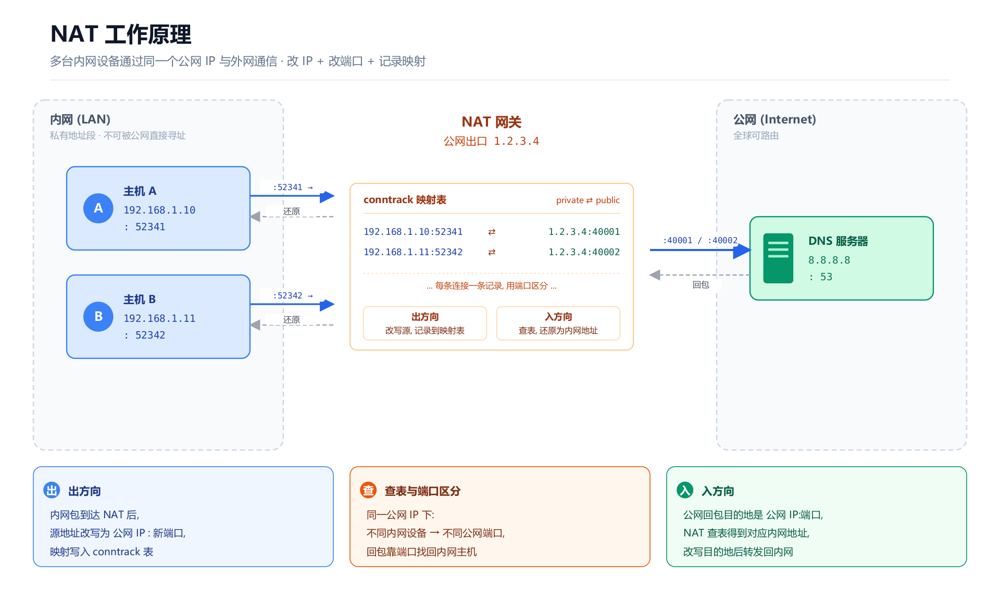
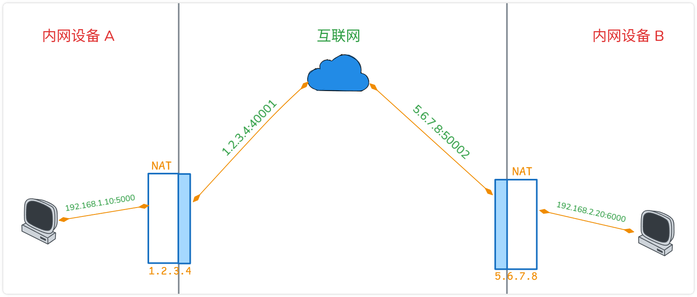

# 历史背景

- 源头
	- 互联网设计之初 (IPv4协议), 用32位二进制数表示IP地址, 总共能提供 43 亿的独立地址.
	- 在80年代, 大家觉得 "这绝对够用了"
- 前身
	- 互联网采用 "端到端" 模式
	- 每台设备插上网线都会获得全球唯一的 "公网IP地址"
	- 任何设备都可以通过这个地址访问你
- 危机诞生
	- 90年代, 个人电脑、手机、物联网设备 爆发式普及, IPv4 地址枯竭, 即将分配完毕
	- IPv6: 彻底的解决方案, 但基础设施的替换需要时间
	- NAT: 工程妥协补丁, 打破端到端模式, 可以延缓 IPv4 危机

# 定义

> NAT 本质是一个 "空间共享复用器". 它让一个私有网络中的无数设备, 通过动态映射的方式, 共享同一个(或几个) 公网IP与外界通信
>
> 它干的事情总结一句话: **在数据包经过某个边界设备时, 修改包里ip地址 / 端口**

网络通信最基本只需要三件事:
1. 标识谁是谁: IP地址
2. 知道把包发到哪里: 路由
3. 让两段能互相回包: 源地址和目标地址可达

# NAT 原理



假设你家里有两台电脑: `192.168.1.10` 和 `192.168.1.11`, 它们想访问公网服务器 `8.8.8.8`, 数据包可能长这样:

```plaintext
源ip: 192.168.1.10
目标IP: 8.8.8.8
```

问题来了, `192.168.1.10` 是私有地址, 公网根本不会路由回这个地址. 服务器收到了包, 回包找不到你

要让公网通信成立, 出口设备必须把这个包 "改造" 一下, 例如:

```plaintext
源ip: 192.168.1.10 -> 你的公网ip 1.2.3.4
目标IP: 8.8.8.8
```

这样服务器回包时, 就会回给 `1.2.3.4` (你家的路由器), 然后路由器再把包转给真正的内网主机 `192.168.1.10`


然而, 只改 ip 还不够, 因为你家可能有很多设备同时访问公网. 如果它们都被改造成同一个公网ip `1.2.3.4`, 那回包时怎么区分该还给谁? 因此, 实际常见的做法是: **同时修改ip和端口**

| 原始连接                               | 出口改写后                         |
| ---------------------------------- | ----------------------------- |
| `192.168.1.10:52341 -> 8.8.8.8:53` | `1.2.3.4:40001 -> 8.8.8.8:53` |
| `192.168.1.11:52342 -> 8.8.8.8:53` | `1.2.3.4:40002 -> 8.8.8.8:53` |

这样回包回来时:
- 发给 `1.2.3.4:40001` 的, 转回 `192.168.1.10:52341`
- 发给 `1.2.3.4:40002` 的, 转回 `192.168.1.11:52342`


**总结**:
1. 内网主机发包, 源: `192.168.1.10:52341`, 目的 `8.8.8.8:53`
2. 经过 NAT 网关
	1. 改包头, 修改为, 源: `1.2.3.4:40001`, 目的 `8.8.8.8:53`
	2. 记录映射表, 在 nat 表中记录 `1.2.3.4:40001 <-> 192.168.1.10:52341`
3. 服务器回包, 回包时发给 `1.2.3.4:40001`
4. NAT 网关查表
	1. 网关发现 `1.2.3.4:40001` 对应 `192.168.1.10:52341`
	2. 将包改回, 转发给内网主机

# 优点 & 代价

- **根本痛点**: 它解决了 "资源绝对短缺" (公网IP不足) 与 "需求无限膨胀" (上网设备激增) 的问题
- **效率与成本** (引入 NAT 额外带来的好处):
	- 降低信息熵 (信息压缩): 如果不使用 NAT, 所有的路由器需要维护一张全球路由表. NAT 将庞大的局域网隐藏在一个公网IP之后, 极大压缩了全球路由状态的信息量
	- 安全性 (物理层面的屏障): 由于 NAT 隐藏了内部设备的真实ip, 外部设备无法直接发起对内网设备的连接, 这种 "单向连通性" 无意中形成了一道天然防火墙

- **代价**
	- **共享公网IP**: 容易被服务端误判为恶意流量遭到限速和封禁
	- **破坏了端到端原则**: p2p, VoIP, 游戏联机, WebRTC 等协议无法使用, 也催生了 STUN、TURN、ICE、UPnp、NAT穿透
	- **成功即失败**: NAT诞生之初明确标记为 "短期解决方案", 随着发展逐渐变成了互联网基础设施. 它越是成功, 越延迟了真正解决方案(IPv6)的到来

# NAT 类型

> RFC 1631和后续标准只定义了NAT "应该做什么"（地址和端口翻译）, 却没有严格规定 NAT 应该怎么做. 不同厂商在实现NAT功能时采用了不同的映射和过滤策略，导致了千差万别的NAT行为.
>
> 这种不一致性对于以客户端-服务器为主的Web浏览来说影响不大, 浏览器总是主动向外发起连接, NAT的入向过滤策略无关紧要. 但对于P2P应用来说, NAT行为的差异直接决定了两个节点能否成功建立直接连接

业界逐渐将 NAT 归纳为四种类型: **完全锥形、受限锥形、端口受限锥形、对称NAT**

- [NAT 类型检测](https://dyebean.com/)

> [!info] 为什么需要区分类型  
> 没有完美的方案, 只有场景的取舍
> - 在玩联机游戏时, 我们追求极致的延迟的p2p连通率(需要最宽松的规则)
> - 在银行、政府、企业内网中, 我们追求极致的安全(需要最严格的规则)

## 最小模型

- 内网主机A: `A = 192.168.1.10:5000`
- NAT公网出口: `P = 1.2.3.4`
- 外部两个服务器
	- `S1 = 8.8.8.8:3478`
	- `S2 = 9.9.9.9:9999`

A 向外发 UDP 包时, NAT 可能建立一个映射: `192.168.1.10:5000 -> 1.2.3.4:62000`

- Q1: A 发给不同外部目标时, 公网端口还一样吗
- Q2: 谁可以往 `1.2.3.4:62000` 发包

|      | 类型     | 特点       | 映射是否复用         | 谁能回包                        |
| ---- | ------ | -------- | -------------- | --------------------------- |
| NAT1 | 完全锥形   | 没有任何限制   | 复用同一个映射        | 任何外部主机都能回                   |
| NAT2 | 受限锥形   | 仅IP受限    | 复用同一个映射        | 只有 "这个内网主机曾经发过包的外部IP" 能回    |
| NAT3 | 端口受限锥形 | IP和端口都受限 | 复用同一个映射        | 只有 "这个内网主机曾经发过包的外部IP+端口" 能回 |
| NAT4 | 对称     | 限制最严     | 不同外部目标分配不同公网映射 | 只有对应的那个外部IP+端口能回            |

## NAT1: FULL Cone (全锥形)

> [!info]
> - 内网地址端口一旦映射成某个公网地址端口, 这个映射就是固定的
> - 只要这个映射还活着, 任何外部主机都可以向这个公网地址端口发包, NAT都会转发给内网主机

```
A 先给 S1 发包：
	192.168.1.10:5000 -> 8.8.8.8:3478

NAT 建立：
	192.168.1.10:5000 <-> 1.2.3.4:62000

之后如果另一个完全不相关的主机：
	7.7.7.7:12345 -> 1.2.3.4:62000

只要映射没超时，NAT 也会把它转给：
	192.168.1.10:5000
```

## NAT2: Address-Restricted Cone (地址受限锥形)

> [!info]  
> 内网主机先向某个公网IP发过包后, NAT才允许这个IP的回包进来

```
A 给 `8.8.8.8:3478` 发过包，于是 NAT 建了：
	- `192.168.1.10:5000 <-> 1.2.3.4:62000`

### 允许
	- `8.8.8.8:9999 -> 1.2.3.4:62000`
	因为虽然端口变了，但 IP 还是 `8.8.8.8`

### 不允许
	- `9.9.9.9:3478 -> 1.2.3.4:62000`
	因为这个 IP `9.9.9.9`，A 没联系过
```

## NAT3: Port-Restricted Cone (端口受限锥形)

> [!info]  
> 内网主机先向某个 "公网 IP + 端口" 发过包后，NAT 才允许这个 "IP + 端口" 的回包进来。

```
A 发给：`8.8.8.8:3478`

建立映射：
	- `192.168.1.10:5000 <-> 1.2.3.4:62000`

### 允许
	- `8.8.8.8:3478 -> 1.2.3.4:62000`

### 不允许
	- `8.8.8.8:9999 -> 1.2.3.4:62000`
	- `9.9.9.9:3478 -> 1.2.3.4:62000`
```

## NAT4: Symmetric (对称形)

> [!info]  
> 同一个内网地址端口，对不同的外部目标，会映射成不同的公网端口

```
A 先发给 `S1`：
	- `192.168.1.10:5000 -> 8.8.8.8:3478`

NAT 分配：
	- `192.168.1.10:5000 -> 1.2.3.4:62000`

然后 A 再发给 `S2`：
	- `192.168.1.10:5000 -> 9.9.9.9:9999`

NAT 又分配：
	- `192.168.1.10:5000 -> 1.2.3.4:62001`

注意，同一个内网源端口 `5000`, 面对不同目标，公网映射变了。


回包限制也会更严格：
	- `1.2.3.4:62000` 只接受 `8.8.8.8:3478`
	- `1.2.3.4:62001` 只接受 `9.9.9.9:9999`

也就是说，一个映射往往和一个具体外部目标绑定。
```

# NAT 打洞

> 随着 Skype, BitTorrent 和 网络游戏的兴起, 人们需要频繁进行 "设备对设备" 的直接通信
>
> 在打洞技术出现前, 由于NAT的阻拦, 两个私网设备想要通信, 必须通过一台公网服务器作为 "中转站". A 把数据发给服务器, 服务器再转发给 B
>
> 如果全球几亿人同时视频聊天, 全部用服务器中转, 再有钱的公司也会被高昂的服务器带宽费弄破产. 工程师想出了一个办法, 让两个藏在 NAT 后面的设备能绕过服务器直接连通

| A    | B    | 是否可打洞 |
| ---- | ---- | ----- |
| 全锥   | 全锥   | ✅     |
| 全锥   | IP受限 | ✅     |
| 全锥   | 端口受限 | ✅     |
| 全锥   | 对称   | ✅     |
| IP受限 | IP受限 | ✅     |
| IP受限 | 端口受限 | ✅     |
| IP受限 | 对称   | ✅     |
| 端口受限 | 端口受限 | ✅     |
| 端口受限 | 对称   | ❌     |
| 对称   | 对称   | ❌     |

## 为什么需要

- **根本痛点**: 解决了NAT环境下 "双向物理阻断" 的问题, 恢复了互联网设计之初的 "端到端通信" 能力
- **效率和成本**:
	- 零带宽成本: 一旦打洞成功, A和B直接通信, 中转服务器可以直接 "下线", 不再消耗一丁点中心服务器的带宽
	- 极低延迟: 中转服务器可能在几千公里外的国外, 而你和朋友就在同城. 打洞成功后, 数据直接走同城骨干网, 延迟从 200ms 骤降到 20ms (这就是为什么联机游戏必须打洞)

## 打洞流程

|     |                     | 说明      |
| --- | ------------------- | ------- |
| A   | `192.168.1.10:5000` | 内网设备    |
| B   | `192.168.2.20:6000` | 内网设备    |
| S   | `6.6.6.6`           | 公网协调服务器 |



前置流程:
1. A,B 先联系协调服务器 S
	- A 发一个 UDP 包给 S
	- B 发一个 UDP 包给 S
	- 于是 S 知道:
		- A 的公网映射 => `1.2.3.4:40001`
		- B 的公网映射 => `5.6.7.8:50002`
2. S 把双方地址互相告诉对方

S 作用:
> 1. 看见 A, B 各自的公网地址
> 2. 把双方的公网地址告诉对方
> 3. 后续双方就可以直接互发 UDP, 不再需要 S 参与数据转发

### NAT1 (A) <-> NAT1 (B)

> [!msg] 注意  
> NAT1 无任何限制, 各自通过对方 NAT公网IP 即可通信

1. A, B 通过各自的NAT公网地址即可进行通信

### NAT1 (A) <-> NAT3 (B)

> [!msg] 注意  
> 端口受限侧 必须先 "点名" 对方, 才能让对方的回包进来

- B 先向 A 发包: 由于 A 是全锥, 任何来源都可以访问, 因此这个包可以到达 A
- 对于 B 来说, 由于刚向 A `1.2.3.4:40001` 发过包, 因此 B 的 NAT 会允许来自 A `1.2.3.4:40001` 的回包
- 打洞完毕

### NAT3 (A) <-> NAT3 (B)

> [!msg] 注意  
> 双方必须先向对方 `NAT公网IP:端口` 发出探测包, 让各自 NAT 都把对方这个具体端点加入允许列表, 这样双方后续的包才能通过

- A 向 B(`5.6.7.8:50002`) 发 UDP 探测包, 同时 B 向 A (`1.2.3.4:40001`) 发 UDP 探测包
	- 对于A侧, NAT-A 看到 A 正在主动联系 B`5.6.7.8:50002`, 因此会允许来自 B 的回包进入
	- B 侧同理
	- 此时双方都能收到对方的回包, 打洞完毕

### NAT1 (A) <-> NAT4 (B)

> [!msg] 注意  
> 由于 对称NAT 给不同目标时, 用不同的公网端口. 因此 A 通过 S 得到的 B 的端口, 不是后续和B通信的端口.  
> 需要 B 主动向 A 发探测包, A 根据 B 的真实地址回包, 才可能建立通信

- B 先发探测包给 A
- A 根据 真实来包 地址回包
- B 收到 A 回包
- 打洞成功

### NAT3 (A) <-> NAT4 (B)

> [!warning]  
> 基本不可用

- A 试图 "先开洞"
	- 由于 A 是端口受限 NAT, A 必须先发包到B `5.6.7.8:50002`, 这样 B 的回包才能进来
- B 向 A 发包
	- 由于 B 是 对称 NAT, NAT-B 大概率不会继续使用 `50002`, 而是为 "到A这条外联" 分配一个新的公网端口 (例: `50037`)
- A 继续打 `50002`, B 真正在 `50037`, 无法打洞
	- A 放行的是错误端口
	- A 发送的也是错误端口


例外:
1. 对称 NAT 其实没那么对称
	- 有些设备虽然被标成 对称NAT, 但对不同目标不一定总换端口, 或端口复用概率高
2. 端口预测
	- 某些 NAT 的外部端口分配有规律 (例如: 递增), 可以猜测下一个端口, 不是稳定方案
	- 例如: A 先开洞时不仅仅向 50002, 同时向 50003~50100 都发送探测, 可能命中 B 实际使用的端口

### NAT4 (A) <-> NAT4 (B)

> [!warning]  
> 基本不可用

双方通过 S 拿到的都不是真正通信时会使用的端点


例外:
1. 并不是真双对称
2. 端口预测
3. 根本不是打洞, 而是 TURN / 中继 / UPnP 显式映射

